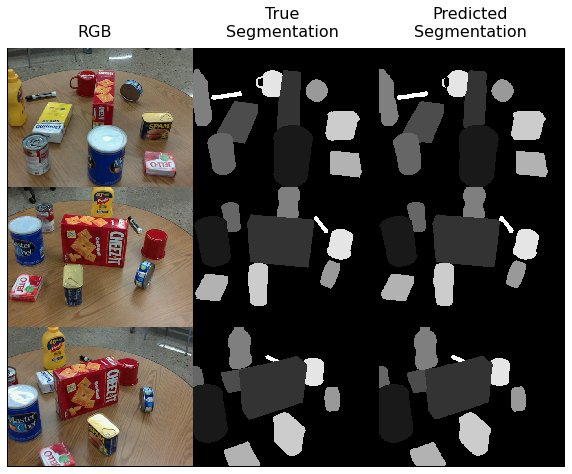
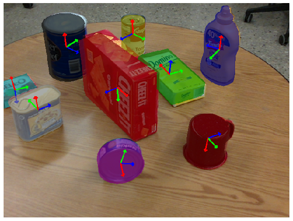

## 🤖 Pose-Estimation-using-PoseCNN
In this project I have implemented an end-to-end object pose estimator, based on PoseCNN, which consists of two stages - feature extraction with a backbone network and pose estimation represented by instance segmentation, 3D translation estimation, and 3D rotation estimation.

### 🎯 Goals of this project:
* Implement the PoseCNN architecture for object pose estimation.
* Understand the characteristics of neural network based object pose estimation using the PROPS Pose Dataset.

## 🗂️ Dataset
The PROPS Pose Estimation Dataset is catered for 6 degrees-of-freedom rigid body object pose estimation. This dataset contains 10 object categories with 500 training images and 500 validation images. Each image in the dataset is a 640x480 RGB color image. Aligned depth images and segmentation masks are also included in the dataset.
The Dataset is available at https://drive.google.com/file/d/15rhwXhzHGKtBcxJAYMWJG7gN7BLLhyAq/view?usp=share_link. Extract it, place it here in the directory, and then you can train the model.

## 🛠️ Test/Demo
Launch the 'pose_estimation.ipynb' notebook

## 🏗️ PoseCNN architecture

## 📊 Results
- Highly accurate segmentation  

- Achieved 50% accuracy on the 5°5 cm metric, i.e. how many visible objects our model was able to predict correctly, where a correct prediction is defined as one with a rotation error of less than 5° and a translation error of less than 5cm.  

