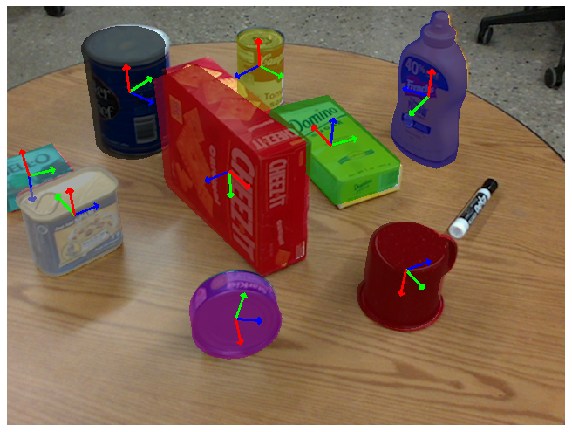

# Pose-Estimation-using-PoseCNN
In this project I have implemented an end-to-end object pose estimator, based on PoseCNN, which consists of two stages - feature extraction with a backbone network and pose estimation represented by instance segmentation, 3D translation estimation, and 3D rotation estimation.

# Dataset
The Dataset is available at https://drive.google.com/file/d/1-MquG0MF5cbbeDUjl3FRH2Jw0nSCjsxi/view?usp=sharing. Extract it and then you can train the model.

# PoseCNN architecture

# Results

